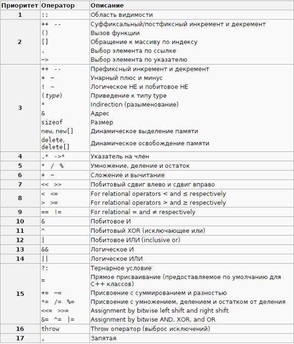

# Язык Си


## Приоритет операций в языке Си/Си++
[Библиографический список](https://en.wikipedia.org/wiki/Operators_in_C_and_C%2B%2B)



## Cscope

Инстурмент интерактивного анализа и поиска функции и струтур данных в С подобных языках

[справка по cscope](https://courses.cs.washington.edu/courses/cse451/12sp/tutorials/tutorial_cscope.html)

Ищем все нужные файлы

    find . -name "*.c" -o -name "*.cpp" -o -name "*.h" -o -name "*.hpp" > cscope.files

Строим базу данных

    cscope -q -R -b -i cscope.files
    -q флаг для ускорения заполнения базы данных, но она становится больше
    -R рекурсивно обходит папки
    -b строит только базу данных
    -i cscope.files берет файлы для индексации из файла

Пользуемся интерактивной утилитой

    cscope -d

Либо плагинами для редакторов например [Sublime text 3](https://packagecontrol.io/packages/Cscope)

## Флаги прекомпиляции GCC

[Predefined macros](https://gcc.gnu.org/onlinedocs/cpp/Predefined-Macros.html)

## Вывод значений define на этапе компиляции
```
/* Some test definition here */
#define DEFINED_BUT_NO_VALUE
#define DEFINED_INT 3
#define DEFINED_STR "ABC"

/* definition to expand macro then apply to pragma message */
#define VALUE_TO_STRING(x) #x
#define VALUE(x) VALUE_TO_STRING(x)
#define VAR_NAME_VALUE(var) #var "="  VALUE(var)

/* Some example here */
#pragma message(VAR_NAME_VALUE(NOT_DEFINED))
#pragma message(VAR_NAME_VALUE(DEFINED_BUT_NO_VALUE))
#pragma message(VAR_NAME_VALUE(DEFINED_INT))
#pragma message(VAR_NAME_VALUE(DEFINED_STR))
```

## Вывод значений размера переменной на этапе компиляции

```
long long brahma;

char (*__kaboom)[sizeof(brahma)];

printf( "%d", __kaboom );
```
Код даст
```
warning: format '%d' expects argument of type 'int', but argument 2 has type 'char (*)[8]' [-Wformat=] printf( "%d", __kaboom );
```
Размер массива и будет означать размер в байтах

## Сборка приложений под Windows

Устанавливаем пакет gcc-mingw-w64-i686 для 32 битной версии windows

Используем для сборки вместо `gcc` `i686-w64-mingw32-gcc`

    i686-w64-mingw32-gcc -g eepromshik.c -o eepromshik.exe

## Полезные ссылки
- [10 главных правил убивания жуков](https://habrahabr.ru/post/226495/)
- [Операторы в C и C++](https://ru.wikipedia.org/wiki/Операторы_в_C_и_C%2B%2B)
- [itoa with GCC](http://www.strudel.org.uk/itoa/)
- [Указатели, ссылки и массивы в C и C++: точки над i](https://habrahabr.ru/post/251091/)
- [volatile для "чайников"](http://www.pic24.ru/doku.php/osa/articles/volatile_for_chainiks)
- [Оптимизации в компиляторах](https://habrahabr.ru/post/124131/)
- [Расширения языков C и C++.](https://habrahabr.ru/post/315676/)
- [Что должно быть в с-файле, а что должно быть в h-файле?](https://habrahabr.ru/post/280764/)
- [Linux unbuffered reads from STDIO](https://stackoverflow.com/questions/17848561/linux-unbuffered-reads-from-stdio)
- [Всё о printf](http://all-ht.ru/inf/prog/c/func/printf.html)
- [Обработка команд при помощи getopt()](https://www.ibm.com/developerworks/ru/library/au-unix-getopt/index.html)
- [Методы отладки использования памяти](https://www.ibm.com/developerworks/ru/library/au-memorytechniques/index.html)
- [Лучшие приемы программирования на C](https://www.ibm.com/developerworks/ru/library/au-hook_duttaC/index.html)
- [Базовые операции с файловой системой UNIX](https://www.ibm.com/developerworks/ru/library/au-unix-readdir/index.html)
- [Алгоритмы работы системных вызовов TCP](https://www.ibm.com/developerworks/ru/library/au-tcpsystemcalls/index.html)
- [Максимально эффективное использование сетевых ресурсов](https://www.ibm.com/developerworks/ru/library/au-highperform1/index.html)
- [Ускоряем обработку данных на клиенте и на сервере](https://www.ibm.com/developerworks/ru/library/au-highperform2/index.html)
- [Часть 1. Портирование исходных текстов C/C++](https://www.ibm.com/developerworks/ru/library/au-porting/index.html)
- [Часть 2. Портирование исходных текстов C/C++](https://www.ibm.com/developerworks/ru/library/au-porting2/index.html)
- [Распределенная компиляция](https://www.ibm.com/developerworks/ru/library/au-dist_comp/index.html)
- [Создание кода, независящего от порядка байтов, на языке C](https://www.ibm.com/developerworks/ru/library/au-endianc/index.html)
- [Развлечения со strace и отладчиком GDB](https://www.ibm.com/developerworks/ru/library/au-unix-strace/index.html)
- [Программирование сокетов](https://www.ibm.com/support/knowledgecenter/ssw_ibm_i_73/rzab6/rzab6soxoverview.htm)
- [Расширения Семейства Языка C](https://www.opennet.ru/docs/RUS/gcc/gcc1-4.html)
- [Open source example](http://www.bogotobogo.com/index.php)
